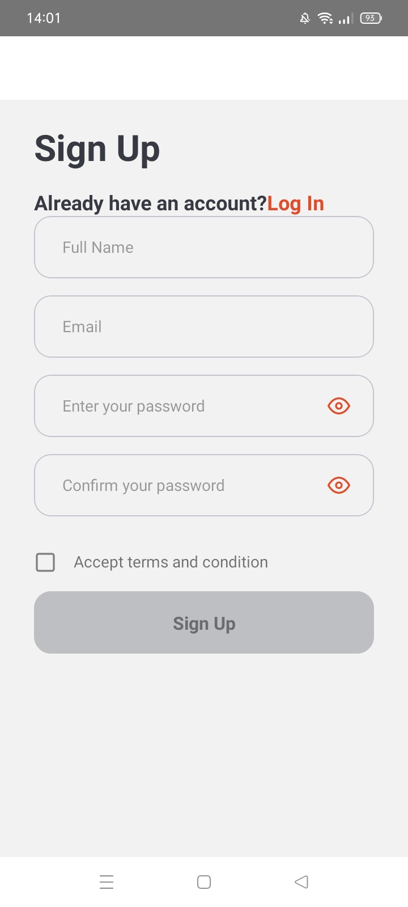
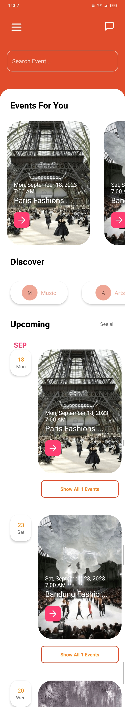
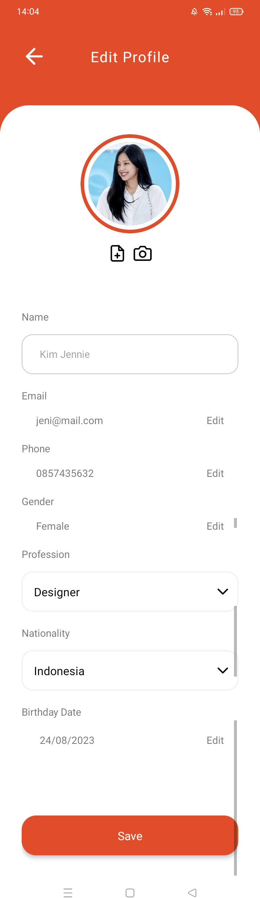
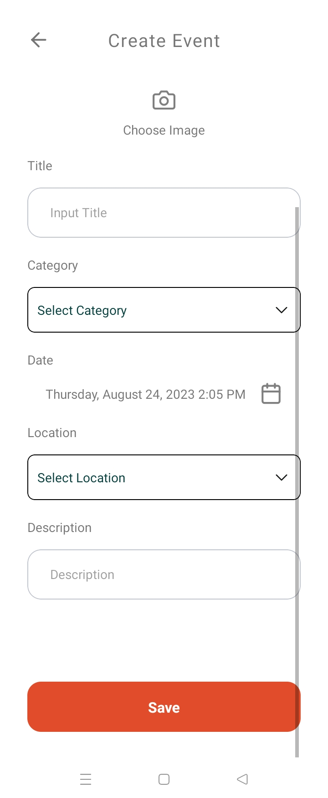

# OnceTicket

OnceTicket App is a mobile application that helps you to order the events you want, not only that you can manage your own events such as create, edit, update & delete.


## Display

<table>
  <tr>
    <td valign="top">Login Page</td>
    <td valign="top">Home Page</td>
    <td valign="top">Profile Page</td>
    <td valign="top">Create Event Page</td>
  </tr>
</table>

# Feature

- Up-to-date and reliable Events Organizing
- Reservation events and create events
- And more
## Build With

1. [Frontend]()
- [React Native](https://reactnative.dev/)

2. [Backend]()
- [Node js](https://nodejs.org/en/)
- [Express js](https://expressjs.com/en/starter/installing.html)

## Tech Stack

- [Redux](https://redux.js.org/)
- [Axios](https://axios-http.com/docs/intro)
- [Argon](https://www.npmjs.com/package/argon2)
- [jwt token](https://www.npmjs.com/package/jsonwebtoken)
- [Multer](https://www.npmjs.com/package/multer)
- [Moment](https://momentjs.com/)
- [Formik](https://formik.org/)

## Run Locally

### 1. Clone the project

```bash
  git clone https://github.com/ardazh/nativeproject
```

### 2. Go to the project directory

```bash
  cd nativeproject
```

### 3. Install dependencies

```bash
  npm install
```

### 4. For debugging mode, make sure you plugged in your phone device with usb-debugging turned on, and set [adb](https://www.xda-developers.com/install-adb-windows-macos-linux/) setting.
To check adb devices connected with your computer, type in your console :
```bash
  adb devices
```
if adb is connected, it should display :
```bash
  List of devices attached
  [your_device_code] device
```
Then
### 5. Start debugging and it will automatically installed debug in your phone

```bash
  react-native run android
```
